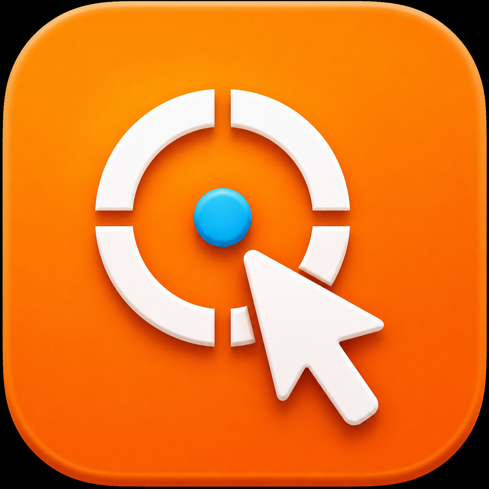

<p align="center">
  
</p>

<h1 align="center">SwiftGrab</h1>

<p align="center">
  macOS inspector capture for AI-ready bug and debug payloads.
</p>

`SwiftGrab` is a Swift + SwiftUI/AppKit tool for capturing the UI context an AI agent needs to help debug native macOS apps: target metadata, cursor/selection coordinates, screenshots, user notes, and structured errors.

The menu bar app uses the native SF Symbol `cursorarrow.rays`; the release app icon is generated from `scripts/assets/swiftgrab-icon-source.png`.

## Features

- Toggle inspect mode with `Cmd+Option+I`.
- Menu bar app for standalone inspector workflows.
- Floating non-activating toolbar: `Select Element`, `Select Region`, `Cancel`, `Copy Payload`.
- Hover highlight and click-to-capture.
- Drag-to-select region capture.
- AI-ready JSON payload with screenshot, metadata, user note, and structured errors.
- SwiftUI modifier for app-local integration.

## Download

Download the latest signed and notarized macOS DMG from GitHub Releases:

https://github.com/joceqo/swift-grab/releases/latest

Current release:

- `v1.0.2`
- `SwiftGrab-1.0.2.dmg`
- Signed with Developer ID
- Notarized and stapled by Apple

Install:

1. Download `SwiftGrab-1.0.2.dmg`.
2. Open the DMG.
3. Drag `SwiftGrab.app` to `Applications`.
4. Launch SwiftGrab.
5. Grant Accessibility access in **System Settings -> Privacy & Security -> Accessibility**.

The app is a menu bar utility. Look for the cursor/rays icon in the macOS menu bar.

## Swift Package

1. In Xcode: **File > Add Package Dependencies...**
2. Add this package URL:

```text
https://github.com/joceqo/swift-grab
```

3. Add product `SwiftGrab` to your macOS app target.

Local development in this repo:

```bash
swift build
swift run SwiftGrabDemo
```

## Quick Start

```swift
import SwiftUI
import SwiftGrab

struct ContentView: View {
    var body: some View {
        MainScreen()
            .swiftGrab(enabled: true, onCapture: { payload in
                print((try? payload.toJSON(prettyPrinted: true)) ?? "")
            })
    }
}
```

You can also control it directly:

```swift
SwiftGrab.onPayloadCaptured { payload in
    print(try? payload.toJSON())
}
SwiftGrab.start(mode: .appLocal)
// ...
SwiftGrab.stop()
```

## Running the Menu Bar App

Use the provided script — it builds a signed `.app` bundle so the Accessibility grant survives rebuilds:

```bash
./scripts/run.sh
```

Then grant Accessibility to `SwiftGrab.app` in **System Settings → Privacy & Security → Accessibility**.

**Do not use `swift run SwiftGrabApp`.** The CLI binary path changes on every rebuild, and macOS TCC treats each rebuilt binary as a new app — the grant won't stick.

## Release Build

Build a signed, notarized DMG:

```bash
VERSION=1.0.2 scripts/make-dmg.sh
```

The release script:

- Builds `SwiftGrabApp` in release mode.
- Creates `SwiftGrab.app`.
- Signs with `Developer ID Application`.
- Creates a DMG, using `create-dmg` when installed or `hdiutil` as a fallback.
- Submits the DMG to Apple notarization.
- Staples and validates the notarization ticket.

## Payload Example

```json
{
  "mode": "appLocal",
  "screenFrame": { "x": 100, "y": 120, "width": 260, "height": 44 },
  "cursorPoint": { "x": 180, "y": 140 },
  "userNote": "Button is broken when clicked",
  "metadata": {
    "appBundleIdentifier": "com.example.MyApp",
    "processIdentifier": 12345,
    "windowTitle": "Main Window",
    "viewType": "NSButton",
    "accessibilityTitle": "Submit",
    "accessibilityValue": null,
    "timestamp": "2026-04-14T16:00:00Z"
  },
  "screenshotPNGBase64": "<base64 PNG>",
  "errors": []
}
```

## How To Send Payload To AI

1. Capture with `Cmd+Option+I`.
2. Add user note in toolbar (`What should AI fix?`).
3. Click target element or region.
4. Use `Copy Payload` and paste JSON into your AI prompt.
5. Ask for a concrete fix using this context and screenshot data.

## App-local V1 Limitations

- Inspects only the host app window hierarchy.
- Inspects only one app-local context (no cross-app AX hit testing yet).
- If Screen Recording is denied, payload is still emitted with metadata and an `errors` entry.

## Icon

The source image for the app icon is:

```text
scripts/assets/swiftgrab-icon-source.png
```

Regenerate all `AppIcon.appiconset` PNG sizes:

```bash
swift scripts/generate-icon.swift
```

The menu bar and panel header use the SF Symbol:

```text
cursorarrow.rays
```
